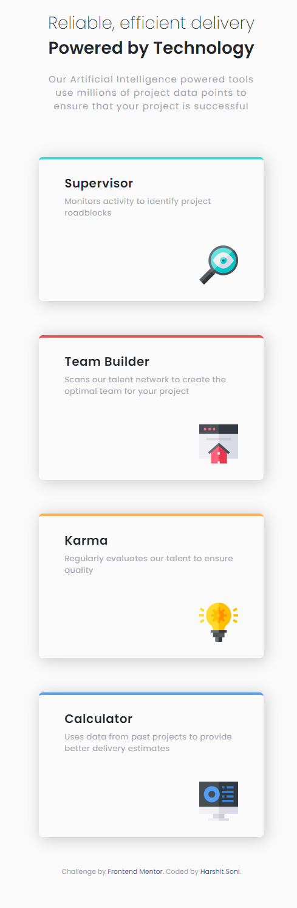

# Frontend Mentor - Four card feature section solution

This is a solution to the [Four card feature section challenge on Frontend Mentor](https://www.frontendmentor.io/challenges/four-card-feature-section-weK1eFYK). Frontend Mentor challenges help you improve your coding skills by building realistic projects.

## Table of contents

- [Overview](#overview)
  - [The challenge](#the-challenge)
  - [Screenshot](#screenshot)
  - [Links](#links)
- [My process](#my-process)
  - [Built with](#built-with)
  - [What I learned](#what-i-learned)
  - [Continued development](#continued-development)
  - [Useful resources](#useful-resources)
- [Author](#author)

## Overview

### The challenge

Users should be able to:

- View the optimal layout for the site depending on their device's screen size

### Screenshot




### Links

- [Solution URL](https://your-solution-url.com)
- [Live Site URL](https://your-live-site-url.com)

## My process

### Built with

- Semantic HTML5 markup
- CSS custom properties
- Flexbox
- CSS Grid
- Mobile-first workflow
- [Styled Components](https://cdn.jsdelivr.net/npm/bootstrap@4.6.0/dist/css/bootstrap.min.css) - For styles

### What I learned

I learned about Multi-column responsive layout.

```html
<div class="row sec-row">____</div>
```
```css
.sec-row {
column-gap: 2.5rem;
}
```

### Continued development

I will keep on practicing various layout challenges, and use these multi-column attributes in them wherever columns are used.  

### Useful resources

- [w3schools-multiple-columns](https://www.w3schools.com/css/css3_multiple_columns.asp) - This helped me understand multi-column responsive layout. I really liked this site and will use it going forward.

## Author

- Frontend Mentor - [@Harshitsoni2000](https://www.frontendmentor.io/profile/Harshitsoni2000)
- GitHub - [@Harshitsoni2000](https://github.com/Harshitsoni2000)
